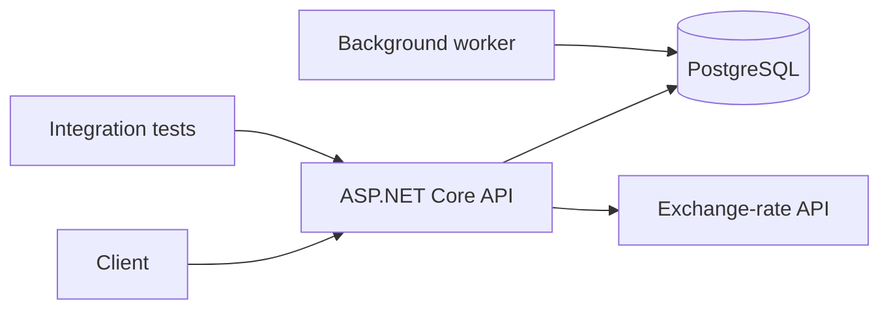

# DotnetAuditDemo

An intentionally flawed ASP.NET Core backend used to demonstrate a practical
`.NET Backend & AI Readiness Audit`.

> [!WARNING]
> This repository contains deliberate security, performance and reliability
> defects. It is a portfolio case study, not a production starter template.
> All credentials in the repository are fake demo values.

## What this case demonstrates

- a realistic ASP.NET Core 8 Web API with PostgreSQL and EF Core;
- authentication, logging, an outbound HTTP client and a background worker;
- Docker Compose and a small integration-test suite;
- 15 evidence-backed findings across security, data access, performance,
  reliability, testing and maintainability;
- a prioritized remediation backlog with effort estimates;
- a separate before/after pull request that fixes five findings.

Start with:

1. [`AUDIT_REPORT.md`](AUDIT_REPORT.md) — executive summary and detailed findings.
2. [`IMPLEMENTATION_PLAN.md`](IMPLEMENTATION_PLAN.md) — sequenced remediation plan.
3. The remediation pull request — focused code changes with local validation.

## Architecture



The solution is split into `Api`, `Application`, `Domain`, `Infrastructure` and
`Tests`. One audit finding is that the runtime code does not consistently respect
those boundaries.

## Run with Docker

Requirements: Docker Desktop with Compose.

```bash
docker compose up --build
```

The API is exposed at `http://localhost:8080`. Sample requests are available in
`src/DotnetAuditDemo.Api/DotnetAuditDemo.Api.http`.

## Run tests locally

Requirements: .NET 8 SDK.

```bash
dotnet restore
dotnet build --configuration Release --no-restore
dotnet test --configuration Release --no-build
```

The tests are deliberately limited to happy paths. That limitation is documented
as finding `F-014`.

## Audit method

The review combines static inspection, dependency and configuration review,
data-flow tracing, EF Core query analysis, threat modeling and executable
verification. Each finding includes severity, evidence, impact, reproduction,
remediation and an effort estimate.

The audit is code-focused. It is not a penetration test, does not inspect
production infrastructure without access, and cannot guarantee discovery of
every vulnerability.

## Contact

Daniil Taushkanov — .NET Backend & AI Readiness Audits

- Email: [taushkanovdaniil@gmail.com](mailto:taushkanovdaniil@gmail.com)
- Telegram: [@DanilDotNet](https://t.me/DanilDotNet)
