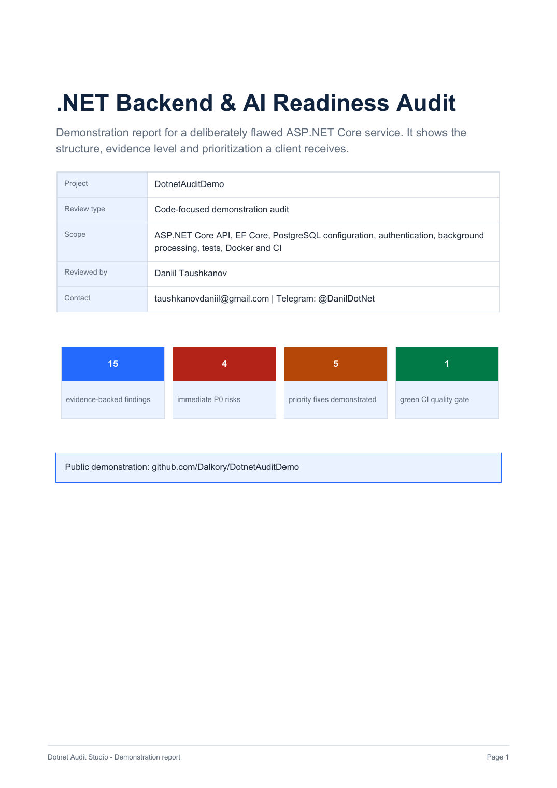
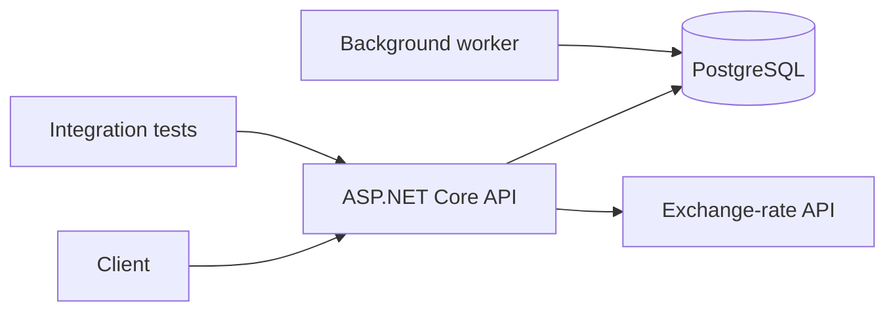

# DotnetAuditDemo

[](https://github.com/Dalkory/DotnetAuditDemo/actions/workflows/ci.yml)
[](https://dotnet-audit-studio.dtauskanov3.chatgpt.site/Dotnet_Audit_Demo_Report.pdf)
[](https://dotnet-audit-studio.dtauskanov3.chatgpt.site/en#request)

An intentionally flawed ASP.NET Core backend used to demonstrate a practical
`.NET Backend & AI Readiness Audit`.

> [!WARNING]
> This repository contains deliberate security, performance and reliability
> defects. It is a portfolio case study, not a production starter template.
> All credentials in the repository are fake demo values.

## Business impact demonstrated

- Unauthorized customer data exposure detected
- Committed credentials detected
- Concurrency risk caused by singleton `DbContext`
- N+1 database access detected
- Unbounded data retrieval detected
- Scoped remediation for findings F-001 through F-005 in an unmerged draft pull request

| Area | Intentionally flawed baseline (`main`) | Draft PR #1 (`4aabfd3`, not merged) |
|---|---|---|
| Admin endpoint | Accessible without authorization | Authentication required; test source asserts 401 for an anonymous request. Role-based 403 behavior is not demonstrated |
| Database access | N+1 query pattern | Paginated projection in code; test source asserts a maximum page size of 100, not a SQL-query count |
| Tracked configuration | Fake demo secrets committed | Demo values removed from tracked application configuration; runtime values supplied externally. No real production-secret rotation is demonstrated |
| `DbContext` lifetime | Singleton | Scoped per request |
| Application logs | Sensitive data recorded | Open finding F-011: login email/password and order customer email are still logged |

This is a synthetic demonstration, not a client case or a production-readiness
claim. The table compares `main` with [draft PR #1 at commit
`4aabfd3`](https://github.com/Dalkory/DotnetAuditDemo/pull/1/commits/4aabfd351571e42112f52aba619234a990821c9e).
The PR has not been merged. Its test source contains assertions for the status
endpoint, anonymous admin access returning 401, and an order-page size capped at
100. Not every table row has an automated test. These checks do not demonstrate
role-based authorization, sensitive-log removal, real credential rotation, or
production readiness. This documentation correction does not claim a new test run.

## What this case demonstrates

- a realistic ASP.NET Core 8 Web API with PostgreSQL and EF Core;
- authentication, logging, an outbound HTTP client and a background worker;
- Docker Compose and a small integration-test suite;
- 15 evidence-backed findings across security, data access, performance,
  reliability, testing and maintainability;
- a prioritized remediation backlog with effort estimates;
- a separate unmerged draft pull request addressing findings F-001 through F-005;
  `main` retains the intentionally flawed baseline, including sensitive logging.

Start with:

1. [`AUDIT_REPORT.md`](AUDIT_REPORT.md) — executive summary and detailed findings.
2. [`IMPLEMENTATION_PLAN.md`](IMPLEMENTATION_PLAN.md) — sequenced remediation plan.
3. [The remediation pull request](https://github.com/Dalkory/DotnetAuditDemo/pull/1)
   — focused code changes with local validation.
4. [The 45-second walkthrough](docs/audit-walkthrough-45s.mp4) — a compact
   overview of the audit, prioritization, and remediation evidence.

[](https://dotnet-audit-studio.dtauskanov3.chatgpt.site/Dotnet_Audit_Demo_Report.pdf)

## Additional demonstration cases

- [`Legacy .NET Modernization Assessment`](case-studies/legacy-modernization/README.md)
  — a synthetic .NET Framework 4.7.2 assessment with a blocker map and a
  phased migration plan. It demonstrates the assessment deliverable, not a
  completed client migration.
- [`Observability Starter for .NET`](case-studies/observability-starter/README.md)
  — a buildable ASP.NET Core 8 example with OpenTelemetry, OTLP export,
  health endpoints, custom business telemetry and an incident runbook.
- [`AI Repo Enablement for .NET`](case-studies/ai-repo-enablement/README.md)
  — a safe-by-default agent-ready repository kit with `AGENTS.md`, Copilot
  instructions, approval boundaries, a preflight checklist and five bounded
  example tasks.
- [`AI Insights for Legacy .NET Reports`](case-studies/ai-insights-legacy-reports/README.md)
  — a working local-first PoC that turns a synthetic 2,000-row XLSX/CSV report
  into deterministic metrics, anomalies, source-row evidence and Markdown
  without sending source rows to an external model.

## Audit packages

| Service | Starting price | Result | Delivery |
|---|---:|---|---:|
| Problem diagnosis | 5,000 ₽ | Root cause evidence and fix plan | 1 business day |
| Architecture second opinion | 10,000 ₽ | Decision review and risk analysis | 1 business day |
| Performance review | 15,000 ₽ | EF Core/SQL findings and measurement plan | 2 business days |
| Independent PR review | 5,000 ₽ | Line-level findings and Approve / Changes required decision | By scope |
| Live .NET debugging | 5,000 ₽ | Joint localization and a written next-step plan | 60–90 minutes |
| Webhook & API reliability review | From 10,000 ₽ | Retry, timeout, idempotency and safe-failure map | 1–2 business days |
| Observability Starter | From 15,000 ₽ | OTel, health checks, OTLP export and incident runbook | 2–3 business days |
| Legacy modernization assessment | From 20,000 ₽ | Blockers, risk map and first-pilot migration plan | 2–3 business days |
| AI Repo Enablement for .NET | Pilot 15,000 ₽; then 25,000 ₽ | Agent instructions, safety boundaries, CI preflight and pilot tasks | 2–3 business days |
| AI Coding Workflow Workshop | 35,000 ₽ | One repository, five real tasks and a trust-vs-verify playbook | By agreement |
| AI Insights PoC | Pilot 30,000 ₽ for the first two | One XLSX/CSV/SQL-view, evidence-linked insights and source code | 3–5 business days |
| Quick audit | 25,000 ₽ | Up to 7 findings, report, backlog, video | 3 business days |
| Full audit | 50,000–80,000 ₽ | Complete technical assessment | 5–7 business days |
| Audit + remediation | From 100,000 ₽ | Report and reviewable pull requests | By scope |

[Request a fixed-scope project review](https://dotnet-audit-studio.dtauskanov3.chatgpt.site/en#request)

## Architecture



The solution is split into `Api`, `Application`, `Domain`, `Infrastructure` and
`Tests`. One audit finding is that the runtime code does not consistently respect
those boundaries.

## Run with Docker

Requirements: Docker Desktop with Compose.

```bash
docker compose up --build
```

The API is exposed at `http://localhost:8080`. Sample requests are available in
`src/DotnetAuditDemo.Api/DotnetAuditDemo.Api.http`.

## Run tests locally

Requirements: .NET 8 SDK.

```bash
dotnet restore
dotnet build --configuration Release --no-restore
dotnet test --configuration Release --no-build
```

The tests are deliberately limited to happy paths. That limitation is documented
as finding `F-014`.

## Audit method

The review combines static inspection, dependency and configuration review,
data-flow tracing, EF Core query analysis, threat modeling and executable
verification. Each finding includes severity, evidence, impact, reproduction,
remediation and an effort estimate.

The audit is code-focused. It is not a penetration test, does not inspect
production infrastructure without access, and cannot guarantee discovery of
every vulnerability.

## Confidentiality

Private repositories and confidential data are not shared with external AI
services without the client's explicit permission. Scope, access rules,
excluded areas, and any permitted AI use are agreed in writing before review.

## Contact

Daniil Taushkanov — .NET Backend & AI Readiness Audits

- Website: [Dotnet Audit Studio](https://dotnet-audit-studio.dtauskanov3.chatgpt.site/en)
- Email: [taushkanovdaniil@gmail.com](mailto:taushkanovdaniil@gmail.com)
- Telegram: [@DanilDotNet](https://t.me/DanilDotNet)
