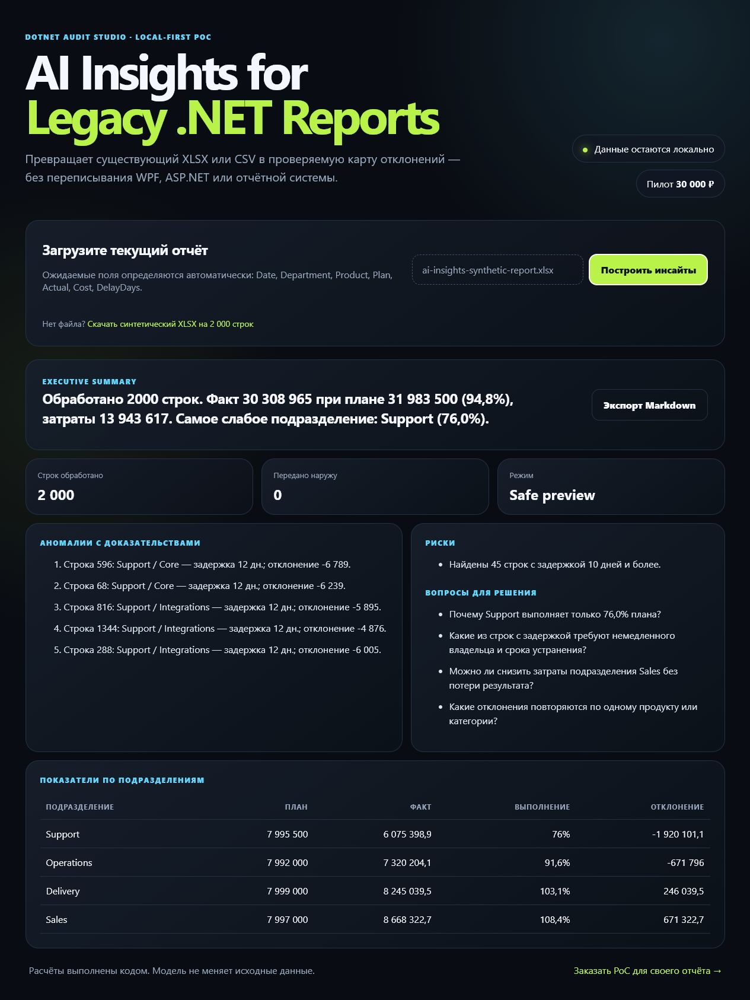

# AI Insights for Legacy .NET Reports

A working local-first proof of concept for adding a verifiable insights layer to
an existing Excel, CSV, WPF, ASP.NET or SQL reporting workflow without rewriting
the source system.

## What the demo proves

- uploads XLSX or CSV and automatically maps English or Russian column aliases;
- calculates totals, plan attainment, trends and department metrics in code;
- detects anomalous rows and keeps source-row evidence for every highlighted item;
- detects sensitive-looking columns and excludes them from the analysis model;
- returns structured JSON and exports a Markdown report;
- records analysis version, narrative mode and the number of externally shared rows;
- uses a deterministic safe-preview mode, so the demo sends zero rows to an
  external model and cannot modify the source file.

The included synthetic XLSX contains 2,000 rows and a fake `ClientEmail` column
to demonstrate redaction. No real customer data or testimonial is used.



[Watch the 60-second visual walkthrough](docs/ai-insights-60s.mp4).

## Run

Requirements: .NET 8 SDK or newer.

```powershell
dotnet run --project src/AiInsights.Web/AiInsights.Web.csproj
```

Open the printed local URL, download the synthetic workbook, upload it back, and
inspect the result. The API endpoint is:

```text
POST /api/analyze
multipart field: file
supported: .xlsx, .csv
```

## Paid pilot

The first two pilots are offered at **30,000 RUB**:

- one XLSX, CSV or agreed SQL view;
- up to five agreed insight types;
- one interface;
- deterministic metric layer and source-row evidence;
- documented data boundary and limitations;
- source code, demonstration session and production recommendations.

The optional model-backed narrative is configured only after the client approves
what aggregates or selected rows may leave its environment. The model never gets
permission to mutate source data.

## Production boundary

This is a demonstrator, not a claim that arbitrary business meaning can be
inferred from any spreadsheet. Production work still requires:

- agreement on field semantics and success thresholds;
- authentication and authorization;
- retention and redaction rules;
- prompt/model/version logging if a model is enabled;
- validation against a representative client dataset;
- human review of recommendations.

Formats and contact:
https://dotnet-audit-studio.dtauskanov3.chatgpt.site/en
